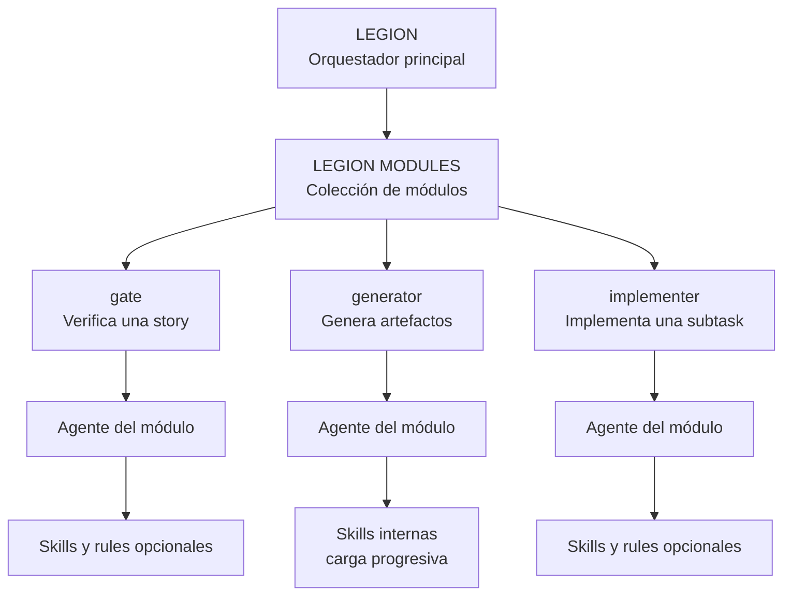

<p align="center">
  
</p>

<p align="center"><a href="README.md">English</a> · <strong>Español</strong></p>

# Legion Modules

 **EGION MODULES:**
capacidades listas para conectar a [Legion](https://github.com/luk-s12/legion).

Instalá agentes especializados que validan historias, generan artefactos o implementan tareas sin
modificar el núcleo de Legion. Cada módulo es independiente, auditable y se ejecuta con permisos
explícitos.

- **Instalación aislada:** usá solamente los módulos que necesita tu proyecto.
- **Permisos visibles:** cada módulo declara qué puede leer, ejecutar y escribir.
- **Contexto bajo demanda:** agentes y skills cargan únicamente las instrucciones necesarias.



**Legion coordina el sistema; cada módulo aporta una capacidad autocontenida.**

## Módulos disponibles

| Módulo | Tipo | Qué entrega |
|---|---|---|
| [`api-collections`](api-collections/module.md) | `generator` | Genera OpenAPI y colecciones para Postman o Insomnia mediante análisis estático, sin ejecutar ni modificar el proyecto. |

Cada módulo vive en su propia carpeta, se instala por separado y no depende de los demás.

## Inicio rápido

Desde una instancia de Legion, podés instalar un repositorio que contiene un solo módulo:

```text
/new-module <repo-o-ruta-al-modulo>
```

También podés apuntar a la raíz de una colección como este repositorio:

```text
/new-module https://github.com/luk-s12/legion-modules
```

Si no hay `module.md` en la raíz, Legion inspecciona las carpetas hijas inmediatas. Cuando
encuentra varios módulos, muestra la lista y valida cada uno por separado; las carpetas que
empiezan con `_`, como `_meta`, se ignoran. Podés aceptar o descartar cada módulo de la colección.

Después de instalar, la forma de usarlo depende del tipo:

```text
# generator
/run-module <installed-name> [worktree:<Story-ID>]

# gate — en requirements-to-work.md
## Modules
- <installed-name>

# implementer — en una subtask
## Subtasks
1. [implementer:<installed-name>] <descripción>
```

Legion valida el manifiesto, muestra un preview de permisos y riesgos, y sólo registra el módulo
después de tu confirmación. En una colección con varios módulos, los nombres instalados siguen la
forma `<repo>_<subfolder>` y el resumen final informa cuáles quedaron registrados. Si se detecta
un único módulo, se instala como un módulo individual usando el nombre del repositorio salvo que
se indique otro.

## Cómo funciona

Un módulo es un proyecto de agente autocontenido con un manifiesto `module.md`. Legion lo clona,
valida su contrato y lo lanza sin editar su código.

| Tipo | Usalo para | Cuándo corre | Dónde puede escribir |
|---|---|---|---|
| `gate` | Verificar una historia y, opcionalmente, bloquearla | En una etapa declarada | En el subpath `writes_to` de su worktree |
| `generator` | Crear artefactos regenerables | Bajo demanda con `/run-module` | En `output`, separado por proyecto |
| `implementer` | Escribir código como autor de una subtask | Sólo cuando la historia lo nombra | En el worktree de esa historia |

Un `gate` nunca reemplaza al revisor adversario. Un `implementer` nunca se activa automáticamente.

## Anatomía de un módulo

```text
<module-name>/
├── module.md
├── .claude/
│   ├── agents/
│   │   └── <agent>.md               # agent_entrypoint apunta a uno
│   ├── skills/
│   │   └── <skill>/SKILL.md         # opcional; guía interna o compartida
│   └── rules/
│       └── module-rules.md          # opcional; provides_rules apunta a este archivo
├── scripts/                         # opcional
├── references/                      # opcional
├── assets/                          # opcional
└── <otros archivos necesarios>      # manifests, schemas, fixtures, etc.
```

El agente contiene su contrato y el flujo principal. Las instrucciones especializadas viven en
skills y se cargan sólo cuando hacen falta. `api-collections` carga siempre OpenAPI, pero sólo
carga Postman, Insomnia o sync cuando fueron solicitados.

No hay una lista cerrada de carpetas adicionales: el módulo se copia como una unidad
autocontenida. `.claude/rules/` es la carpeta canónica y puede contener varias reglas separadas.
El contrato actual de `provides_rules` apunta a un archivo itemizado concreto —por convención,
`.claude/rules/module-rules.md`—, no a la carpeta completa. Puede declarar otro path interno
cuando exista una razón. `agent_entrypoint`,
`provides_skills` y `provides_rules` siempre deben resolver a archivos dentro del módulo. Un
`AGENTS.md` interno no forma parte del contexto que Legion
inyecta al ejecutar el módulo, por lo que las instrucciones necesarias deben vivir en el agente
o en sus skills.

### Manifiesto mínimo

```yaml
---
type: generator
output: modules/output/<module-name>/<base-repo-name>/
scope: base-repo
tools:
  - Read
  - Grep
  - Glob
  - Write
agent_entrypoint: .claude/agents/<agent-name>.md
---
```

Los campos cambian según el tipo. El template comentado es la fuente más rápida para empezar:

- [Template de `module.md`](_meta/template/module.md)
- [Guía completa para crear módulos](_meta/docs/AUTHORING.es.md)

## Skills y reglas compartidas

Los módulos `gate` e `implementer` pueden aportar:

- `provides_skills`: procedimientos que usa el agente implementador de la historia.
- `provides_rules`: reglas puntuales que Legion negocia una vez por proyecto.

Las skills internas pertenecen al agente del módulo y se cargan progresivamente; no se declaran
en `provides_skills`. La guía de autoría explica ambos mecanismos.

## Seguridad por diseño

Legion hace visible el alcance antes de ejecutar un módulo:

- Cruza las tools del manifiesto con las declaradas por el agente.
- Señala acceso a comandos, red y dependencias potencialmente vulnerables.
- Comprueba las zonas de escritura antes y después de la ejecución.
- Nunca amplía silenciosamente los permisos aprobados.
- Repite el preview si una actualización cambia el contrato.

> **Importante:** `module.md` declara y audita capacidades, pero no reemplaza un sandbox técnico.
> Un módulo con `Bash` tiene el alcance del proceso que lo ejecuta.

## Crear un módulo

1. Copiá [`_meta/template/module.md`](_meta/template/module.md) a una carpeta nueva.
2. Elegí `gate`, `generator` o `implementer`.
3. Escribí el agente con la lista mínima de tools.
4. Separá instrucciones condicionales en skills.
5. Instalalo con `/new-module` y revisá el preview.
6. Ejecutalo contra una instancia real de Legion antes de publicarlo.

**[Crear y validar un módulo →](_meta/docs/AUTHORING.es.md)**

## Licencia

Este repositorio se distribuye bajo los términos de [LICENSE.md](LICENSE.md).
