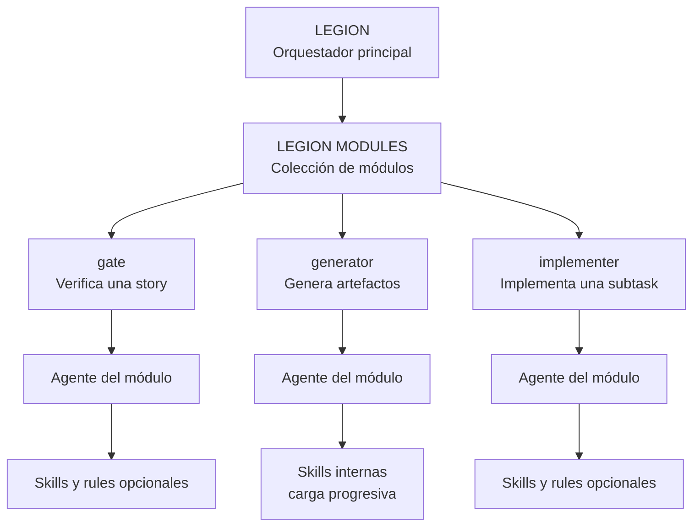

<p align="center">
  
</p>

<p align="center"><a href="README.md">English</a> · <strong>Español</strong></p>

# Legion Modules — colección oficial de módulos para Legion

 **EGION MODULES**
es un **monorepo de módulos para [Legion](https://github.com/luk-s12/legion)**, el sistema de
orquestación multiagente dinámico. Un **módulo** es un proyecto de Claude Code autocontenido — un
agente, opcionalmente con skills — que se conecta a una orquestación de Legion para verificar una
historia de usuario (`type: gate`), producir un artefacto standalone a partir de un repo base
(`type: generator`), o escribir código directo en el worktree de una historia como su autor
(`type: implementer`), sin que Legion tenga que ser dueño de ese código ni editarlo. Legion trata
a cada módulo igual que trata al propio proyecto destino: lo clona, lo lee, y nunca lo toca a
mano.

Cada módulo vive en su **propia carpeta de primer nivel** dentro de este repo (ej. `dummy-e2e/`,
`api-collections/`) — independiente de las demás, instalable por separado. No hay runtime
compartido entre módulos: instalar uno nunca requiere instalar otro.



La jerarquía conserva la idea romana: **Legion** coordina la fuerza completa; cada módulo es una
unidad autocontenida con su propio agente y, cuando lo necesita, skills especializadas que se
cargan de manera progresiva.

## Índice

- [Qué es un módulo (y qué no es)](#qué-es-un-módulo-y-qué-no-es)
- [Estructura del repo](#estructura-del-repo)
- [Tipos de módulo](#tipos-de-módulo)
- [El manifiesto `module.md`](#el-manifiesto-modulemd)
- [Skills y rules que trae un módulo](#skills-y-rules-que-trae-un-módulo-provides_skillsprovides_rules)
- [`type: implementer`](#type-implementer--un-módulo-que-escribe-código)
- [Crear un módulo nuevo](#crear-un-módulo-nuevo)
- [Autoconfig: instalar directo desde el template](#autoconfig-instalar-directo-desde-el-template)
- [Probar un módulo contra una instancia real de Legion](#probar-un-módulo-contra-una-instancia-real-de-legion)
- [Modelo de confianza](#modelo-de-confianza)
- [Ciclo de vida una vez instalado](#ciclo-de-vida-una-vez-instalado)

## Qué es un módulo (y qué no es)

Un módulo **no** es un fork de Legion y no modifica `CLAUDE.md`, el orquestador, ni ningún otro
worktree. Es un proyecto de Claude Code independiente que el comando `/new-module` de Legion
clona dentro de `modules/installed/<name>/` en una instancia de Legion, valida contra un contrato
de manifiesto, y a partir de ahí lanza como cualquier otro subagente — con las mismas reglas de
aislamiento que un `worktree-agent`:

- Un módulo `type: gate` solo escribe dentro del worktree de la historia que lo disparó (o un
  subpath declarado de ese worktree).
- Un módulo `type: generator` solo escribe dentro de su carpeta `output` declarada — nunca dentro
  del repo base ni de un worktree que esté leyendo.
- Un módulo `type: implementer` tiene `Write`/`Edit` real sobre el worktree **entero** de la
  historia que lo nombró — el permiso más amplio que da cualquier módulo, y solo porque una
  historia lo pidió explícito (`## Subtasks: [implementer:<name>]`), nunca elegido de forma
  automática ni activado por default en todas las historias.
- Ninguno de los tres se comunica con otro worktree, otro módulo, ni escribe directamente en
  `.orchestrator/signals/`/`.orchestrator/announcements/` — los hallazgos van a
  `modules/reports/`, y solo el orquestador de Legion decide si algo se escala.

## Estructura del repo

```
legion-modules/
├── README.md                        ← versión en inglés
├── README.es.md                     ← estás acá
├── _meta/                           # todo lo que no es un módulo instalable — branding, scaffolding
│   ├── assets/                       # logos/wordmarks usados por los READMEs
│   └── template/                     # esqueleto de module.md para copiar al arrancar un módulo nuevo
└── <module-name>/                   # una carpeta por módulo, instalable por separado
    ├── module.md                     # manifiesto — ver abajo (_meta/template/ por ahora solo trae este archivo)
    ├── .claude/                      # agents/, opcionalmente skills/ — ver "Crear un módulo nuevo" (forma exacta puede cambiar)
    │   └── ...
    └── ...                            # cualquier otro archivo que la lógica del agente necesite
```

Una carpeta de módulo es exactamente lo que termina clonado en el `modules/installed/<name>/` de
una instancia de Legion — nada por encima de la carpeta del módulo en este repo forma parte de lo
que se instala.

## Tipos de módulo

Definidos y aplicados por el propio `modules/README.md` de Legion — este repo construye módulos
*contra* ese contrato, no lo define de forma independiente:

| Tipo | Corre cuando | ¿Puede rechazar una historia? | Escribe en |
|---|---|---|---|
| `gate` | En un `valid_stages` de la historia (ej. `post-finalized`), opt-in vía `## Modules` de la historia o `default_activation: always` | Sí, si `blocking: true` (misma autoridad que el revisor adversario para ese hallazgo — nunca lo reemplaza) | `writes_to`, un subpath del worktree de la historia |
| `generator` | Bajo demanda, vía `/run-module <name>` — completamente fuera del ciclo de historias | No — nunca produce un veredicto | `output`, namespaced automáticamente por proyecto destino |
| `implementer` | Solo cuando una historia lo nombra explícito (`## Subtasks: [implementer:<name>]`) — nunca autoseleccionado, `default_activation: always` se rechaza directo para este `type` | No tiene veredicto propio — su código pasa por el mismo gate de diseño y `worktree-reviewer` que cualquier implementador | El worktree **entero** de la historia que lo nombró — sin `writes_to` que lo acote |

Un módulo `gate` nunca se convierte en la única puerta a `finalized` — el `worktree-reviewer` de
Legion siempre tiene la última palabra, incluso cuando un módulo `gate` es `blocking: true`.

## El manifiesto `module.md`

Frontmatter YAML, `snake_case`, un comentario por campo — misma convención que Legion usa para
`.orchestrator/config.md`. Los campos obligatorios dependen del `type`:

- **Siempre**:
  - `type` — `gate` | `generator` | `implementer`.
  - `tools` — lista YAML de tools declaradas (`Read`, `Grep`, `Glob`, `Bash`, `Write`, `Edit`;
    cualquier otra queda marcada como riesgo desconocido en el preview de `/new-module`).
  - `agent_entrypoint` — path relativo, dentro de la propia carpeta del módulo, al agente que
    Legion lanza (ej. `.claude/agents/mi-agente.md`).
- **`type: gate`**, además:
  - `valid_stages` — lista de etapas soportadas; hoy Legion solo tiene implementada
    `post-finalized`.
  - `default_stage` — una de las etapas listadas en `valid_stages`.
  - `default_activation` — `opt-in` (necesita `## Modules` en la historia) | `always`.
  - `writes_to` — path dentro del worktree, o `""` (string vacío) si nunca escribe. La clave debe
    existir siempre, aunque su valor esté vacío.
  - `blocking` — `true` | `false`.
  - Opcionales: `max_rejection_rounds` (entero), `max_concurrent` (entero), `requires_local_config`
    (`true` | `false`), `provides_skills` (lista de paths), `provides_rules` (path) — ver
    [Skills y rules que trae un módulo](#skills-y-rules-que-trae-un-módulo-provides_skillsprovides_rules).
- **`type: generator`**, además:
  - `output` — path con la forma `modules/output/<module-name>/<base-repo-name>/`
    (el segmento `<base-repo-name>` lo completa Legion automáticamente).
  - `scope` — `base-repo` | `worktree`.
  - Ninguno de los campos exclusivos de `gate` aplica — esto incluye `provides_skills`/
    `provides_rules`: un `generator` nunca entra al ciclo de la historia, así que no hay quién
    los consuma. `/new-module` los rechaza directo en este `type`.
- **`type: implementer`**, sin campos adicionales obligatorios; opcionalmente `provides_skills`/
  `provides_rules` (mismo formato que `gate`). `writes_to`, `blocking`, `valid_stages`/
  `default_stage`, `max_rejection_rounds`, `max_concurrent` **no** aplican — `/new-module`
  rechaza cualquiera de esos si está presente. `default_activation` solo puede ser `opt-in` en
  este `type` (`always` se rechaza directo) — ver
  [`type: implementer`](#type-implementer--un-módulo-que-escribe-código).

### Ejemplo `type: gate`

```yaml
---
type: gate                                # gate | generator | implementer
valid_stages:                             # etapas que este módulo soporta técnicamente (una o más)
  - post-finalized
default_stage: post-finalized             # se usa cuando la historia no especifica etapa
default_activation: opt-in                # opt-in (necesita ## Modules en la historia) | always
tools:                                     # Legion NUNCA extiende esta lista al lanzar
  - Bash
  - Read
  - Grep
  - Glob
  - Write
agent_entrypoint: .claude/agents/e2e-runner.md
writes_to: e2e/                           # path DENTRO del worktree solamente (vacío si no lo toca)
max_rejection_rounds: 3                   # nunca más laxo que max_correction_rounds del config.md destino
max_concurrent: 1                         # default, si se omite: 1 si writes_to no está vacío, ilimitado si está vacío
requires_local_config: true               # si es true, /new-module chequea .env.<base-repo>.local (solo existencia)
blocking: true                            # true = puede REJECTED como el revisor; false = va al ADVISORY del revisor
provides_skills:                          # opcional — paths dentro del propio clone del módulo, formato SKILL.md
  - skills/oop-practices/SKILL.md
provides_rules: rules.md                  # opcional — path dentro del propio clone del módulo, itemizado con rule_id
---

# Module: e2e-runner
```

## Skills y rules que trae un módulo (`provides_skills`/`provides_rules`)

Un módulo `type: gate` o `type: implementer` puede, además de su función principal, aportar
contenido que el agente implementador lee directo — **solo para la historia que referencia al
módulo**, nunca fusionado a las convenciones propias del proyecto donde se instala, nunca
aplicado a una historia que no lo pida.

- **`provides_skills`** — guía procedimental (una checklist, un how-to), en el mismo formato que
  `.claude/skills/<name>/SKILL.md`. El agente implementador la lee completa, con la misma
  autoridad que el `QUALITY_GUIDE` propio de Legion.
- **`provides_rules`** — enunciados puntuales tipo regla que SÍ pueden contradecir una regla real
  del proyecto donde se instala, así que Legion los negocia explícito con el usuario la primera
  vez que una historia de ese proyecto referencia al módulo — **una sola vez por proyecto**,
  nunca al momento de instalar con `/new-module` (un módulo de este repo es una librería
  reutilizable contra muchos proyectos distintos a lo largo del tiempo, así que el momento de
  instalar es demasiado temprano para saber contra qué reglas de qué proyecto se va a chequear).
  Lo aceptado termina embebido como texto real en el diseño de esa historia, nunca fusionado a
  las reglas propias del proyecto que lo instaló.

Cada path de `provides_skills` y el propio path de `provides_rules` deben resolver a un archivo
real dentro de la carpeta del módulo — `/new-module` rechaza el manifiesto directo si alguno no
existe.

### Formato de `rules.md` (a qué apunta `provides_rules`)

Una entrada por regla, cada una con un **`rule_id` estable** que vos definís (Legion nunca
inventa uno) más su enunciado:

```md
### no-mutable-public-fields
Los campos públicos nunca deben ser mutables — exponé un getter y un método
setter/mutador dedicado en vez de un campo público directo.

### max-function-length
Una función de más de 40 líneas debe partirse — extraé helpers nombrados por cada paso lógico.
```

`rule_id` debe ser único dentro del archivo — `/new-module` rechaza un `rules.md` con duplicados
o con una entrada sin `rule_id`.

### Ejemplo `type: generator`

```yaml
---
type: generator
output: modules/output/<module-name>/<base-repo-name>/   # namespacing agregado automáticamente por Legion
scope: base-repo                                          # base-repo | worktree — contra qué corre por default
tools:
  - Read
  - Grep
  - Glob
  - Write
agent_entrypoint: .claude/agents/api-collection-generator.md
---

# Module: api-collections
```

### Ejemplo `type: implementer`

```yaml
---
type: implementer
tools:
  - Read
  - Grep
  - Glob
  - Write
  - Edit
agent_entrypoint: .claude/agents/code-quality-writer.md
provides_skills:                          # opcional — mismo formato que gate
  - skills/oop-practices/SKILL.md
provides_rules: rules.md                  # opcional — mismo formato que gate
---

# Module: code-quality-pro
```

## `type: implementer` — un módulo que escribe código

A diferencia de `gate` (verifica, puede rechazar) y `generator` (produce un artefacto
standalone), el agente de un módulo `type: implementer` **escribe código directo en el worktree
de una historia**, como su autor — el mismo rol que juega un implementador nativo de Legion, pero
con origen en tu clone.

- **Sin `writes_to`** — no hay una zona más chica que ofrecer que el worktree entero, así que
  este `type` no declara ninguna. Legion verifica el aislamiento al revés: un chequeo duro de
  `git status` contra el repo base y contra cualquier otro worktree *inactivo* (cualquier
  diferencia ahí es un incidente), y un cruce best-effort contra los eventos propios de la
  historia hermana para cualquier worktree *activo en paralelo* — un diff plano no puede
  distinguir "el módulo se escapó de su worktree" de "una historia en paralelo simplemente
  avanzó", así que ese caso nunca se marca automático, solo queda registrado para revisión
  manual.
- **Nunca autoseleccionado** — solo corre porque una historia lo nombra explícito:
  `## Subtasks: 1. [implementer:<module-name>] <descripción>`. `default_activation: always` se
  rechaza a propósito al instalar este `type`: un módulo de terceros con acceso de escritura real
  nunca reemplaza al implementador nativo en silencio, en todas las historias.
- **Mismo gate de diseño, sin atajos** — tu agente propone su propio diseño para su subtask y
  pasa por la misma barrera que cualquier otro implementador.
- **Revisor, sin cambios** — `worktree-reviewer` audita tu código exactamente igual que
  cualquier otro, contra el diseño aprobado (que ya tiene resuelto cualquier conflicto de
  `provides_rules`).

## Crear un módulo nuevo

**Arrancá desde [`_meta/template/`](_meta/template/)** — por ahora trae solo
[`_meta/template/module.md`](_meta/template/module.md): un esqueleto de manifiesto completamente comentado,
con los bloques de `gate` y de `generator` incluidos y marcados para borrar el que no
corresponda. Copiá ese archivo a la carpeta de tu módulo y editalo — no hace falta que
reconstruyas la forma del manifiesto a partir de la referencia de abajo. El resto de la carpeta
del módulo (`.claude/agents/`, opcionalmente `.claude/skills/`) lo escribís desde cero, siguiendo
la estructura de arriba.

```
mkdir mi-modulo
cp _meta/template/module.md mi-modulo/module.md
```

1. **Elegí el tipo** — `gate` si el módulo tiene que poder verificar (y eventualmente rechazar)
   una historia; `generator` si solo lee código y produce un artefacto standalone, sin veredicto;
   `implementer` si tiene que escribir código directo en el worktree de una historia, como su
   autor (ver [`type: implementer`](#type-implementer--un-módulo-que-escribe-código) — acceso
   real de `Write`/`Edit` sobre un worktree entero, solo corre cuando una historia lo nombra
   explícito).
2. **Creá la carpeta** `<module-name>/` en la raíz de este repo (o copiá `_meta/template/module.md`
   ahí adentro como se muestra arriba).
3. **Escribí `module.md`** siguiendo el formato de arriba — todos los campos obligatorios para el
   `type` declarado (ver [El manifiesto `module.md`](#el-manifiesto-modulemd)). No hace falta
   resolver a mano los placeholders `<...>` que quedaron del template: `/new-module` los reconoce
   y ofrece completarlos de forma interactiva en vez de rechazar el manifiesto directo — ver
   [Autoconfig: instalar directo desde el template](#autoconfig-instalar-directo-desde-el-template).
4. **Escribí el agente** en el path declarado en `agent_entrypoint` (`.claude/agents/<name>.md`),
   con una lista `tools:` en su frontmatter que **coincida** con el `tools:` de `module.md` —
   `/new-module` cruza ambas y marca cualquier tool que el agente use en la práctica pero el
   manifiesto no haya declarado. Mantené el agente lo más read-only posible: para un módulo
   `gate`, tocá solo `writes_to`; para un `generator`, tocá solo `output`. Nunca asumas acceso a
   `STORY`, `BRANCH` o `EVENTS` salvo que el prompt que Legion arma para ese tipo de módulo
   realmente los pase (un `generator` invocado sin `worktree:` no recibe ninguno de los dos
   últimos).
5. **Sumá skills si el agente necesita una checklist o guía de referencia** para aplicar de forma
   consistente (`.claude/skills/<name>/SKILL.md`) — mismo patrón que usa el propio Legion con
   `security-guide`/`data-guide` junto a sus agentes especialistas. Mantené el entrypoint enfocado
   en su contrato y el ruteo, e indicá exactamente cuándo debe leer cada skill; una skill
   condicional no debe cargarse en corridas que no la necesitan. `api-collections` es el ejemplo
   de referencia: OpenAPI se carga siempre, mientras Postman, Insomnia y sync se cargan solo
   cuando corresponden. Estas skills internas no van en `provides_skills`, que inyecta guía al
   agente implementador de una story. Es opcional, no todo módulo necesita skills.
6. **Mantené el perfil de riesgo tan bajo como el trabajo lo permita.** `tools` fuera de
   `Read, Grep, Glob, Bash, Write, Edit` queda marcado como desconocido por el escaneo de
   `/new-module`; `Bash` en particular implica que el módulo puede leer cualquier cosa que el
   proceso alcance, más allá de `writes_to`/`output` — un riesgo aceptado y explícito, no algo
   que declarar en `writes_to` pueda prevenir técnicamente. No recurras a `Bash` (ni a una CLI
   externa a la que le haría shell out) si el agente puede armar la salida él mismo con `Write`.
7. **Probalo localmente** contra una instancia real de Legion antes de darlo por terminado — ver
   la sección siguiente.

## Autoconfig: instalar directo desde el template

No todo dev que agarra `_meta/template/` conoce el contrato del manifiesto de Legion lo suficiente
como para completar cada campo a mano al primer intento — es esperable, no un bloqueo. Si
apuntás `/new-module` a un módulo cuyo `module.md` todavía tiene placeholders `<...>` sin
resolver en campos obligatorios (o el propio `type` sigue siendo `<gate|generator>`), Legion no
lo rechaza directo como manifiesto incompleto. En cambio, corre un **asistente de autoconfig**:

1. Si `type` sigue sin resolver, te lo pregunta primero — nada más se puede inferir sin eso.
2. Si `agent_entrypoint` ya apunta a un agente real, lee el `tools:` de su propio frontmatter y
   precompleta el `tools:` del manifiesto con eso — así no tipeás la misma lista dos veces.
3. Pregunta lo que quede, vía `AskUserQuestion`, en lotes chicos, con un default razonable
   preseleccionado donde exista uno (`default_activation: opt-in`, `blocking: true`,
   `requires_local_config: false`, etc.) — confirmar suele alcanzar, solo hace falta texto libre
   para valores que Legion realmente no puede adivinar (`writes_to`, `valid_stages`, `output`).
4. Escribe los valores resueltos en su propia copia recién clonada,
   `modules/installed/<name>/module.md`, y continúa el flujo normal de instalación desde ahí — el
   preview de riesgo que ves después indica que el manifiesto se completó vía autoconfig, para
   que sepas que parte de lo que estás aprobando no lo escribió el autor del módulo tal cual.

Esto solo completa lo que todavía es un placeholder del template — un campo que dejaste
deliberadamente con un valor real, no-placeholder, nunca se toca ni se cuestiona. Y tampoco es
una excepción al contrato: lo que salteés en el asistente igual necesita un valor real antes de
que el manifiesto pase la validación, igual que cualquier otro `module.md` incompleto.

## Probar un módulo contra una instancia real de Legion

Un módulo solo se prueba a sí mismo pasando de verdad por el flujo de instalación y ejecución de
Legion — releer el manifiesto no es una prueba.

1. En una instancia de Legion (el repo orquestador, no este), corré
   `/new-module <path-a-este-repo>/<module-name>` apuntando a la carpeta local de tu módulo. Esto
   corre toda la validación que Legion aplica a cualquier módulo: chequeo de campos obligatorios,
   clasificación de `tools`, el cruce manifiesto-vs-agente, un escaneo de red best-effort, un
   escaneo de dependencias vulnerables si hay un manifiesto de paquetes presente — y después te
   muestra el preview completo antes de registrar nada.
2. Aceptá el preview (`modules/pending/<module-name>.md` en esa instancia de Legion) para
   registrarlo en `modules/registry.md` como `installed`.
3. **Para `type: gate`**: corré `/legion` sobre una historia que liste tu módulo en `## Modules`
   (`opt-in`) o poné `default_activation: always` y corré cualquier historia. Confirmá que se
   lanza en el `stage` que declaraste, que escribe solo dentro de su subpath `writes_to`, y que un
   rechazo deliberado (`blocking: true`) efectivamente frena a la historia de llegar a
   `finalized` hasta corregirse.
4. **Para `type: generator`**: corré `/run-module <module-name>` contra el repo base, y de nuevo
   con `worktree:<Story-ID>` contra una historia `finalized`. Confirmá que el artefacto cae bajo
   `modules/output/<module-name>/<base-repo-name>/` y que `workspace/<base-repo>` (o el worktree)
   sale de la corrida sin cambios inesperados (`git status --porcelain` antes y después).
5. **Para `type: implementer`**: escribí una historia con `## Subtasks: 1.
   [implementer:<module-name>] <descripción>` y corré `/legion` sobre ella. Confirmá que el
   `DESIGN_PROPOSED` de tu agente pasa por el mismo gate que cualquier implementador, que solo
   toca su propio worktree asignado, y que `worktree-reviewer` audita su código igual que
   cualquier otro.
6. Si declaraste `provides_rules`, confirmá que la primera historia que referencia al módulo
   contra un proyecto dado dispara la negociación única (`AskUserQuestion`), y que una segunda
   historia del mismo proyecto no vuelve a preguntar.
7. Una vez que se comporta como se espera, está listo para proponerse como inclusión en este
   repo.

## Modelo de confianza

`/new-module` valida **forma, no intención** — la misma postura bajo la que se construyen los
módulos de este repo. Un preview de riesgo limpio no es garantía de seguridad, y ningún campo de
`module.md` es un sandbox técnico:

- `tools: [Bash]` implica ejecución arbitraria de comandos con el alcance del proceso host, no el
  de `writes_to`/`output`.
- Los escaneos de red y dependencias son pattern-matching / detección de manifiestos, no análisis
  de flujo de datos — existen para poner información real frente a quien instala el módulo, no
  para bloquear de forma automática.
- Un módulo nunca amplía sus propios `tools` en tiempo de ejecución — la instancia de Legion que
  lo instala nunca extiende lo que se validó al momento de instalar.

Construir un módulo para este repo significa escribirlo de forma que sus `tools`/`writes_to`/
`output` declarados sean el alcance *real* completo de lo que necesita — no el mínimo que pasa la
revisión. `type: implementer` es el permiso más amplio de los tres (`Write`/`Edit` sobre un
worktree entero, sin `writes_to` que lo acote) — sostenelo con el mismo estándar: el gate de
diseño y `worktree-reviewer` son la defensa real, igual que para cualquier implementador, nativo
o no.

## Ciclo de vida una vez instalado

Una vez que un módulo de este repo está instalado en una instancia de Legion, su ciclo de vida lo
administra por completo esa instancia, no este repo:

- `/module uninstall <name>` / `/module activate <name>` — deprecarlo, reactivarlo, o borrarlo.
- `/module renegotiate <name> [rule_id]` — reabre un veredicto de `provides_rules` para el
  proyecto actual, sin esperar a un cambio de versión.
- Antes de cada lanzamiento corre automáticamente un chequeo de versión/contrato (`git fetch`
  sobre el clone instalado); si `tools`/`writes_to`/`output`/`type` cambiaron upstream (es decir,
  en este repo), la instancia que lo instaló vuelve a correr el flujo completo de preview de
  riesgo antes de dejar correr el código actualizado. Si `rules.md` cambió, solo se renegocian
  por proyecto los `rule_id` nuevos o reformulados — el resto mantiene su veredicto existente.

Eso significa que un cambio acá — endurecer `tools`, agregar un campo, corregir un bug del
agente — lo toma de forma segura cada instancia de Legion que tenga el módulo instalado, sin
ampliar en silencio lo que está autorizado a hacer.
