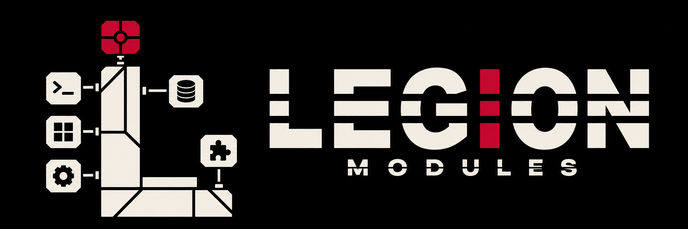
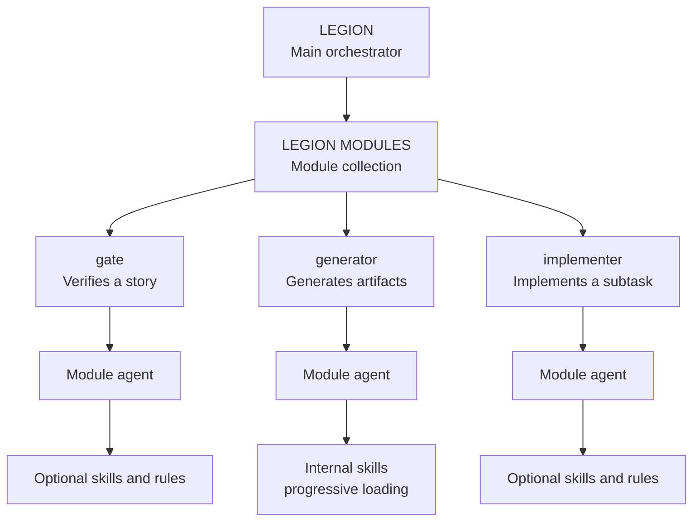

<p align="center">
  
</p>

<p align="center"><strong>English</strong> · <a href="README.es.md">Español</a></p>

# Legion Modules

 **EGION MODULES:**
ready-to-install capabilities for [Legion](https://github.com/luk-s12/legion).

Add specialized agents that verify stories, generate artifacts, or implement tasks without
changing Legion's core. Every module is independent, auditable, and runs with explicit permissions.

- **Isolated installation:** use only the modules your project needs.
- **Visible permissions:** every module declares what it can read, execute, and write.
- **On-demand context:** agents and skills load only the instructions needed for each run.



**Legion coordinates the system; each module contributes one self-contained capability.**

## Available modules

| Module | Type | What it delivers |
|---|---|---|
| [`api-collections`](api-collections/module.md) | `generator` | Generates OpenAPI and Postman or Insomnia collections through static analysis, without executing or modifying the project. |

Every module has its own folder, installs separately, and does not depend on the others.

## Quick start

From a Legion instance, install a repository containing one module:

```text
/new-module <repo-or-path-to-module>
```

You can also target the root of a collection such as this repository:

```text
/new-module https://github.com/luk-s12/legion-modules
```

When the root has no `module.md`, Legion scans its immediate child folders. If it finds multiple
modules, it shows the list and validates each one independently; `_`-prefixed folders such as
`_meta` are skipped. You may accept or discard each module in the collection.

How you use an installed module depends on its type:

```text
# generator
/run-module <installed-name> [worktree:<Story-ID>]

# gate — in requirements-to-work.md
## Modules
- <installed-name>

# implementer — in a subtask
## Subtasks
1. [implementer:<installed-name>] <description>
```

Legion validates the manifest, shows a permission and risk preview, and registers the module only
after you confirm it. In a multi-module collection, installed names follow
`<repo>_<subfolder>`, and the final summary lists what was registered. When exactly one module is
detected, it installs as an individual module using the repository name unless another name is
specified.

## How it works

A module is a self-contained agent project with a `module.md` manifest. Legion clones it, validates
its contract, and launches it without editing its code.

| Type | Use it to | When it runs | Where it can write |
|---|---|---|---|
| `gate` | Verify and optionally block a story | At a declared story stage | The `writes_to` subpath in its worktree |
| `generator` | Create regenerable artifacts | On demand through `/run-module` | Its project-namespaced `output` |
| `implementer` | Write code as a subtask author | Only when explicitly named by a story | That story's worktree |

A `gate` never replaces Legion's adversarial reviewer. An `implementer` never activates
automatically.

## Module anatomy

```text
<module-name>/
├── module.md
├── .claude/
│   ├── agents/
│   │   └── <agent>.md               # agent_entrypoint selects one
│   ├── skills/
│   │   └── <skill>/SKILL.md         # optional internal or shared guidance
│   └── rules/
│       └── module-rules.md          # optional; provides_rules points to this file
├── scripts/                         # optional
├── references/                      # optional
├── assets/                          # optional
└── <other required files>           # manifests, schemas, fixtures, etc.
```

The agent holds its contract and main flow. Specialized instructions live in skills and load only
when needed. `api-collections` always loads OpenAPI guidance, but loads Postman, Insomnia, or sync
guidance only when requested.

Additional folders are not restricted: Legion copies the module as a self-contained unit.
`.claude/rules/` is the canonical folder and may contain multiple rule files. The current
`provides_rules` contract points to one concrete itemized file—by convention,
`.claude/rules/module-rules.md`—not to the whole folder. It may declare another internal path
when needed. `agent_entrypoint`, `provides_skills`, and
`provides_rules` must always resolve inside the module folder. Legion does not inject an internal
`AGENTS.md` into the module's runtime context, so
required instructions must live in the agent or its skills.

### Minimal manifest

```yaml
---
type: generator
output: modules/output/<module-name>/<base-repo-name>/
scope: base-repo
tools:
  - Read
  - Grep
  - Glob
  - Write
agent_entrypoint: .claude/agents/<agent-name>.md
---
```

Fields vary by module type. Start from the commented template:

- [`module.md` template](_meta/template/module.md)
- [Complete module authoring guide](_meta/docs/AUTHORING.md)

## Shared skills and rules

`gate` and `implementer` modules may contribute:

- `provides_skills`: procedures used by the story's implementing agent.
- `provides_rules`: individual rules Legion negotiates once per project.

Internal module skills belong to the module's own agent and load progressively; they do not go in
`provides_skills`. The authoring guide explains both mechanisms.

## Security by design

Legion makes scope visible before running a module:

- It cross-checks manifest tools against the agent declaration.
- It flags command, network, and potentially vulnerable dependency access.
- It verifies write zones before and after execution.
- It never silently expands approved permissions.
- It repeats the preview when an update changes the contract.

> **Important:** `module.md` declares and audits capabilities, but is not a technical sandbox.
> A module with `Bash` has the reach of its host process.

## Create a module

1. Copy [`_meta/template/module.md`](_meta/template/module.md) into a new folder.
2. Choose `gate`, `generator`, or `implementer`.
3. Write the agent with the smallest useful tool set.
4. Move conditional guidance into skills.
5. Install it through `/new-module` and review the preview.
6. Run it against a real Legion instance before publishing.

**[Create and validate a module →](_meta/docs/AUTHORING.md)**

## License

This repository is distributed under [LICENSE.md](LICENSE.md).
